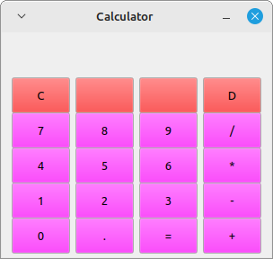
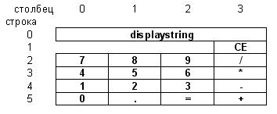

# Калькулятор на Qt Creator  

  
## Как работает программа:  
  
В *displaystring* выводим результаты вычислений (и показываем там числа/операции в процессе их набора).  
  
Для хранения двух чисел и выбранной над ними операции используем реализованный в QT стек *(QStack <QString> stack;)*.  
  
Метод *createButton* создает одну кнопку с указанной параметром подписью.  
  
Метод *calculate* выполняет операции вычисления. Ограничиваемся стеком из 3 элементов, а вычисление выполняется либо по нажатию "=", либо когда выбрана следующая операция. Это избавит от необходимости работы со скобками и учитывать старшинство операций.   
  
Обработчик событий (слот) калькулятора с именем *slotButtonClicked* выполняет работу по реагированию на нажатия кнопок.  

Кнопки будем размещать в сетку из ячеек, размерностью 6 строк на 4 столбца.  

